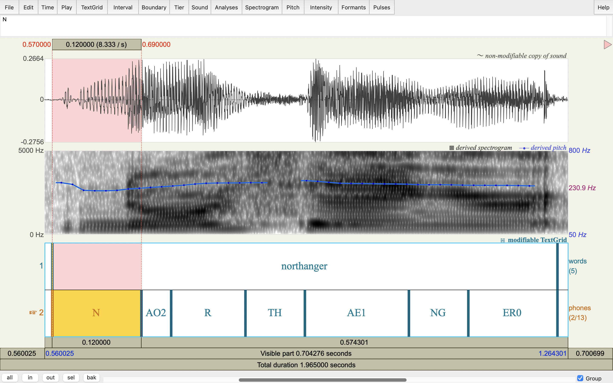

# PhonemeDF
This repository shows example **PhonemeDF**, a phoneme-level framework for analyzing the discriminability between *real* and *synthetic* speech across modern **TTS (Text-to-Speech)** and **VC (Voice Conversion)** systems.

---

## 🧩 Repository Structure

PhonemeDF/
│
├── assets/
│   ├── audio_samples/      # Example .wav audio clips from Real and 7 synthetic systems
│   │                       # Each file name follows the format:
│   │                       # <utteranceID>-<system>.wav
│   │                       # e.g., 19-198-0003-MeloTTS.wav, 19-198-0003-Real.wav
│   │
│   ├── ref/                # 10 Reference speaker audio files (e.g., p228_023.wav)
│   │                       # These are short speech segments used as target voices
│   │
│   └── textgrid_samples/   # Sample TextGrid files from Montreal Forced Aligner(MFA).
│                           # Each TextGrid contains phoneme-level timestamps (start/end)
│                           # for both real and synthetic audio, following ARPAbet labels (AA, AE, B, CH, etc.)
│                           # Used to perform phoneme-level analysis.
│
├── index.html              # Interactive demo page to our dataset(e.g., for listening and comparing samples)
│
└── README.md                # Repository documentation (the file you’re reading now)

## 🎛️ Example Phoneme Alignment (TextGrid Visualization)

The figure below shows an example TextGrid visualization
Each tier corresponds to one phoneme, with start and end times aligned in seconds.

*Figure: Example TextGrid showing phoneme boundaries for Real and MeloTTS speech
aligned using Montreal Forced Aligner (MFA). Each block corresponds to one phoneme.*

---

